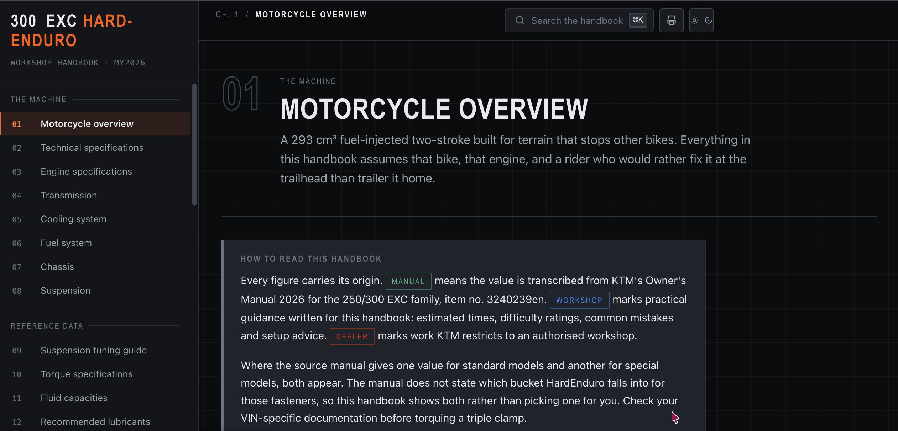
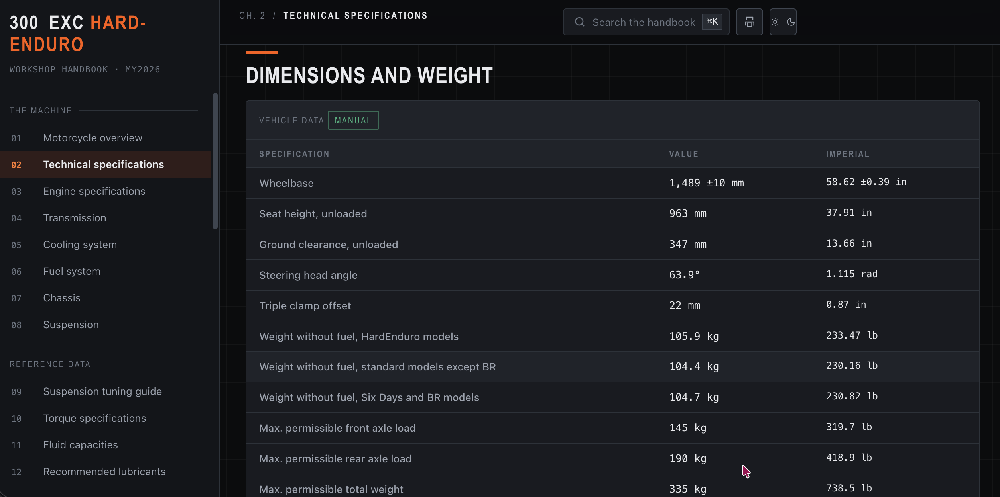
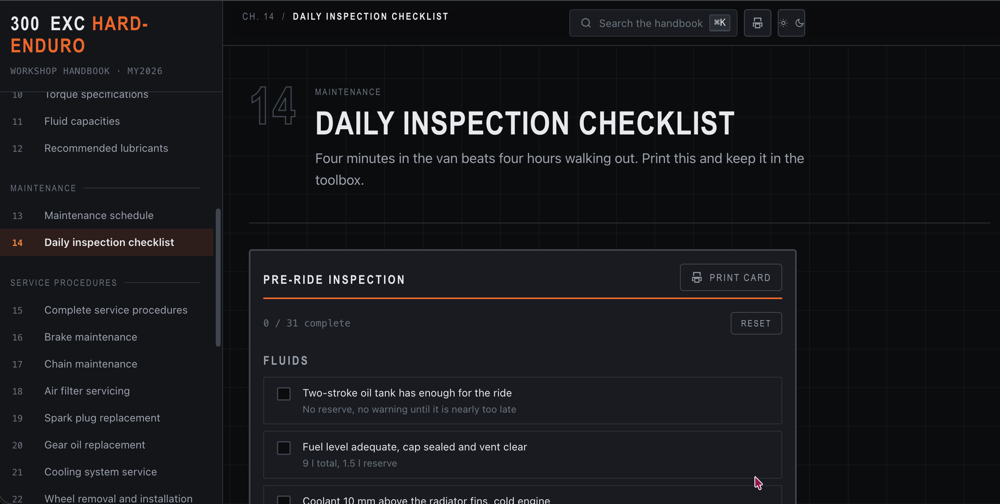
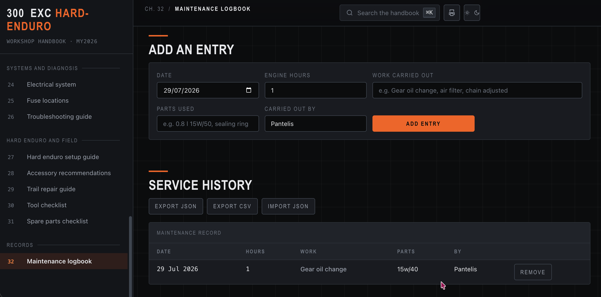

# KTM 300 EXC HardEnduro Workshop Handbook

**Status: ACTIVE**

An offline, dependency-free workshop handbook for the KTM 300 EXC HardEnduro
(2025/2026). Zero runtime dependencies, zero network requests, no framework.

**Live: <https://ktm-300-exc-handbook.netlify.app>**



## Why I built this

I ride a 300 EXC. The owner's manual is a 7 MB PDF: fine at a desk, useless on a
phone in a field with one bar of signal, and unsearchable in any way that helps
when you need a torque figure with the bike already on its side. So I built the
handbook I actually wanted in the van.

One hard requirement drove the architecture: it has to open by double-clicking a
file on a laptop with no network. That rules out ES modules, `fetch` and
`localStorage`, all of which browsers block or cripple over `file://`. Every
structural decision in this repo is downstream of that constraint, and they are
written up in *Engineering notes* rather than left implicit.

The second requirement matters more. A wrong torque figure is not a rendering
bug, it strips a thread or drops a wheel. So the data had to prove itself rather
than be trusted: all 121 torque values were transcribed and verified
programmatically against the source text, every figure carries a badge stating
where it came from, and where the manual is genuinely ambiguous the handbook
says so instead of quietly picking a side. The same instinct runs through the
build, where `dist/` cannot go stale because the deploy fails if it does.

That is the thesis I build everything on, applied to a workshop manual rather
than a data pipeline: infrastructure that proves it works.

## Interface

Thirty-two chapters in one document, routed by hash, with a persistent chapter
rail and a search field that reaches every heading, procedure and torque value.



*Specification tables carry a provenance badge and both unit systems, reproducing
KTM's own rounding convention rather than recalculating it.*



*All 25 checklists track a live count and reset in place. Print card renders the
list as hand-fillable boxes on A4.*



*The logbook holds entries in memory and exports to JSON or CSV, because
`file://` pages cannot use `localStorage`. A JSON export is portable, diffable
and survives a cleared cache.*

## Running it

Two ways:

- **Served** - the repo root is the publish directory. `python3 -m http.server`
  and open `index.html`, or point any static host at it.
- **Offline single file** - `dist/ktm-300-exc-handbook.html` is one
  self-contained document. Copy it to a laptop and open it by double-clicking,
  no server and no connection.

> Unofficial. Not affiliated with, endorsed by, or produced by KTM AG.
> Torque figures are transcribed from published owner documentation; verify
> against your own VIN-specific manual before working on the bike.

## Structure

```
ktm_300_exc/
├── index.html                  32 chapters as semantic <section> elements
├── assets/
│   ├── css/
│   │   ├── tokens.css          colour, type, spacing, motion tokens
│   │   ├── base.css            reset, typography, primitives
│   │   ├── layout.css          app shell, rail, content, sticky TOC
│   │   ├── components.css      torque chips, callouts, procedures, cards
│   │   └── print.css           A4 output, three print modes
│   └── js/
│       ├── data.torque.js      121-row torque database
│       ├── theme.js            dark / light
│       ├── nav.js              hash router, chapter rail, TOC scroll spy
│       ├── search.js           instant search index and overlay
│       ├── torque-db.js        filtering, sorting, deep-link focus
│       ├── procedures.js       procedures, printing, checklists, logbook
│       └── app.js              bootstrap
├── tools/
│   ├── build.py                inlines the tree into the single-file bundle
│   └── css-audit.py            static cascade checks
├── dist/
│   └── ktm-300-exc-handbook.html   build output, committed on purpose
├── docs/
│   └── screenshots/            README images only, not referenced by the app
├── 404.html                    served-only, not part of the bundle
├── netlify.toml                publish dir, CSP, deploy-time checks
└── README.md
```

## Build

The served tree is the source. The single file in `dist/` is generated from it,
never edited directly, and `--check` fails the moment it goes stale against the
source:

```
python3 tools/build.py            # regenerate dist/
python3 tools/build.py --check    # fail if dist/ is stale
python3 tools/css-audit.py        # static cascade checks
```

## Deploy

Netlify, configured in `netlify.toml`. The repo root is the publish directory
and there is nothing to compile, so the build command is the check suite:

```
python3 tools/build.py --check && python3 tools/css-audit.py
```

A deploy fails if `dist/` was not rebuilt alongside a source change, which makes
the "never edit `dist/` by hand" rule self-enforcing rather than a convention.

Three deliberate choices in that config:

- **No SPA catch-all redirect.** Routing is hash-based and every path is a real
  file, so `/* /index.html 200` would only turn genuine 404s into a blank
  chapter. `404.html` handles them instead.
- **`connect-src 'none'` in the CSP.** The handbook makes zero network requests
  by design, so the browser may as well enforce it. `style-src` has to allow
  inline styles: the markup uses style attributes and the JS sets them on
  injected rows.
- **No `immutable` cache header on `assets/`.** The filenames are not
  content-hashed, so a long max-age would serve stale CSS after every deploy.
  ETag revalidation is correct here.

`dist/ktm-300-exc-handbook.html` is served with `Content-Disposition:
attachment`. It is meant to be copied to a laptop, and downloading rather than
rendering it keeps the site-wide CSP from having to allow inline scripts.

## Source and data provenance

Everything in the handbook derives from one document: the **KTM 250/300 EXC
Owner's Manual 2026**, item no. **3240239en**, the PDF KTM issues to owners.

That PDF is copyright KTM AG and is **not redistributed here**. Get the copy that
matches your VIN from KTM's own channels:

- [Manuals & Maintenance](https://www.ktm.com/en-gb/service/manuals.html)
- [Print on Demand portal](https://print.ktm.com/) for PDF downloads and printed
  copies, including older model years

The pipeline was: extract the text from that PDF, transcribe the specification
and torque tables into semantic HTML, then verify the transcription
programmatically against the extracted source rather than by eye. Every figure in
the handbook is then labelled with where it came from:

| Badge | Meaning |
|---|---|
| **Manual** | Transcribed from KTM Owner's Manual 2026, 250/300 EXC family, item no. 3240239en |
| **Workshop** | Practical guidance written for this handbook: estimated times, difficulty ratings, common mistakes, hard enduro setup |
| **Dealer** | Work KTM restricts to an authorised workshop, or that needs the diagnostic tool |

All 121 torque values and all 33 distinct newton-metre figures were verified
against the source text programmatically. The pound-feet column reproduces
KTM's own rounding convention (one more decimal place than the metric value
carries), and every conversion matches the printed table verbatim.

**Known ambiguity:** the manual splits several triple clamp and steering stem
torques between "all standard models" and "all special models", without stating
which bucket HardEnduro falls into. Both rows appear, labelled. Verify against
your VIN-specific documentation before torquing those fasteners.

**Scope:** this is a maintenance and setup handbook derived from owner
documentation. It is not a repair manual. Engine internals and suspension
internals are marked *Dealer* and are not covered.

## Features

- **Search** - `⌘K`, `Ctrl+K` or `/`. Indexes chapters, sections, procedures,
  specification rows and every torque value. Searching `80 nm` or `swingarm`
  both work.
- **Torque database** - chapter 10. Filter by subsystem, thread family and
  threadlocker requirement; sort any column. Search results for a fastener
  deep-link into the table and highlight the row.
- **Three print modes** - current chapter (masthead button), complete handbook
  (chapter 32), and single bench cards (*Print card* buttons). Procedures always
  print fully expanded, and checklist boxes print as hand-fillable squares.
- **Logbook** - chapter 32. Add entries, export to JSON or CSV, import a
  previous export.

## Engineering notes and trade-offs

**Classic scripts, not ES modules.** Browsers refuse module imports over
`file://`. Since the whole point is opening `index.html` on a laptop in a van
with no network, the JS uses classic scripts behind a `KTM` namespace. Modular
by file and responsibility, not by `import`.

**Content in HTML, torque data in JS.** Chapter content is authored as semantic
HTML so it is readable, printable and indexable in one place. The torque table
is data because it needs filtering and sorting, which markup cannot do. Search
builds its index from the rendered DOM plus that one data module, so content
never has to be maintained twice.

**No browser storage.** `file://` pages get a null origin and browsers block
`localStorage` there, so persistence would work on one machine and silently lose
data on another. The logbook holds entries in memory and exports to a file you
keep. A JSON export is portable, diffable and survives a cleared cache, which is
what a service history actually needs - put it in a git repo and you have a
versioned one.

**Single HTML file.** Splitting chapters into separate files would need `fetch`,
which `file://` also blocks. One document, routed client-side.

## Accessibility and quality floor

Responsive to 320px, keyboard navigable throughout, visible focus rings,
`prefers-reduced-motion` respected, `prefers-color-scheme` followed until you
override it, and sortable table headers exposed with `aria-sort` plus keyboard
activation.

All 25 checklists carry a count and a reset button, and every count is a live
region, matching the torque filter count.

## Verification

What is checked in this repo today:

| Check | How | Status |
|---|---|---|
| CSS cascade and grid integrity | `python3 tools/css-audit.py`, 12 assertions | passing |
| Horizontal overflow, 320px to 1440px | browser pass, itemised below | passing, not automated |
| `dist/` bundle matches source | `python3 tools/build.py --check` | passing |
| Deploy headers and CSP | local server replaying `netlify.toml` headers | passing, not automated |
| Runtime behaviour | manual browser pass, itemised below | passing, not automated |

**Manual pass, 2026-07-29, Chromium, served from the repo root.** Exactly what
was exercised:

- Boot and routing: 32 chapters registered, hash routing to a chapter works,
  121 torque rows rendered.
- Torque filters: Brakes narrows to 9, Brakes + Wheels to 16, M8 to 24, free
  text `spindle` to 2, and Reset restores all 121.
- Torque sorting: click and `Enter` both sort, `aria-sort` tracks the rendered
  order, and Reset returns the headers to the default state.
- Search: hits for `swingarm` (17), `80 nm` (23), `air filter` (37) and
  `coolant` (63), zero for a nonsense term.
- Theme toggle: flips `data-theme` dark and back.
- Checklists: all 25 lists render a count matching their own checkbox total,
  ticking updates it, and Reset clears both the boxes and the count.
- Logbook: add renders a row, Export JSON emits `application/json` with the
  entry, Export CSV emits `text/csv` with quoted fields.
- Bundle: `dist/` boots identically, 32 chapters and 121 rows, zero external
  requests, and the served-only download block is correctly stripped out.

**Header pass, 2026-07-29.** The headers in `netlify.toml` were replayed by a
local server and the site exercised under them, because a plain
`python3 -m http.server` sends none of them and would have proved nothing. Under
the real CSP: no violations in the console on load, the inline-styled
empty-state row in the torque table still renders centred, and both logbook
exports produce a `blob:` download. The 404 page serves with a 404 status and
follows `prefers-color-scheme`, since `theme.js` does not run there.

**Live deploy, 2026-07-29.** All five security headers arrive as configured,
`/dist/` serves with `Content-Disposition: attachment`, an unknown path returns
a real 404, and the site boots with zero console errors under the production
CSP: 32 chapters, 121 torque rows, 25 wired checklists.

**Continuous deployment is wired.** Pushes to `main` trigger a Netlify build via
a repository webhook and a read-only deploy key, so the build command runs on
every push.

What that gate is verified to do, precisely: `build.py --check` exits 0 on a
fresh `dist/` and 1 on a stale one, checked locally; and Netlify ran
`python3 tools/build.py --check && python3 tools/css-audit.py` in its own build
image for commit `f6f0a9d` and went green. A green build is only reachable by
that command running and exiting 0, which also settles the open question about
`python3` being present in the build image. Not observed directly: a red build
from a deliberately stale `dist/`. That last step relies on Netlify failing a
deploy when the build command exits non-zero, which is its documented default.

**Logbook import and narrow viewports, 2026-07-29.** Import parses a previous
export and replaces the table, both the bare array and `{entries: [...]}` shapes.
Narrow rendering found and fixed one real bug: the logbook form's "Work carried
out" field carried a fixed `grid-column: span 2` on an `auto-fit` grid, so below
about 30rem, where auto-fit resolves to a single column, the span forced an
implicit second column and pushed the whole page into horizontal scroll. Now
zero page-level overflow at 320px, 360px and 1440px, with the two-track span
still intact on desktop.

Worth recording for anyone tempted by the obvious fix: `grid-column: 1 / -1`
does **not** work here. An end line of `-1` does not expand inside
`repeat(auto-fit, ...)`, so it silently collapses to a single track at every
width. It removes the overflow and quietly loses the desktop layout.

**Still not exercised:** the three print modes. Print output is hard to verify
headlessly and has only been eyeballed.

**Not yet automated.** An earlier draft of this README claimed 26 headless
checks; that harness is not in this repo. Everything above is verified by hand,
and automating it is the first item in *Next*.

## Next

- [ ] Port the manual pass above into Playwright specs and run them in CI.
      That is the check that makes the rest of this README self-enforcing.
- [ ] Feature-detect `localStorage` so theme and logbook persist when served
      over a real origin, keeping the in-memory path as the `file://` fallback.
- [ ] Service worker and web app manifest: installable and offline-capable
      without giving up the served version.
